# Algorithms

## Searching

### [Binary Search](binary_search.py)

Given a sorted array arr[] of n elements, write a function to search a given element x in arr[].
A simple approach is to do linear search.The time complexity of above algorithm is O(n). Another approach to perform the same task is using Binary Search.

**Binary Search**: Search a sorted array by repeatedly dividing the search interval in half. Begin with an interval covering the whole array. If the value of the search key is less than the item in the middle of the interval, narrow the interval to the lower half. Otherwise narrow it to the upper half. Repeatedly check until the value is found or the interval is empty.

The idea of binary search is to use the information that the array is sorted and reduce the time complexity to O(Log n).

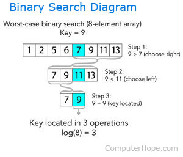

We basically ignore half of the elements just after one comparison.

1. Compare x with the middle element.
2. If x matches with middle element, we return the mid index.
3. Else If x is greater than the mid element, then x can only lie in right half subarray after the mid element. So we recur for right half.
4. Else (x is smaller) recur for the left half.

#### Pseudocode

```Procedure binary_search
   A ← sorted array
   n ← size of array
   x ← value to be searched

   Set lowerBound = 1
   Set upperBound = n 

   while x not found
      if upperBound < lowerBound 
         EXIT: x does not exists.
   
      set midPoint = lowerBound + ( upperBound - lowerBound ) / 2
      
      if A[midPoint] < x
         set lowerBound = midPoint + 1
         
      if A[midPoint] > x
         set upperBound = midPoint - 1 

      if A[midPoint] = x 
         EXIT: x found at location midPoint
   end while
   
end procedure
```


The above recurrence can be solved either using Recurrence Tree method or Master method. It falls in case II of Master Method and solution of the recurrence is Theta(Logn).

**Auxiliary Space**: O(1) in case of iterative implementation. In case of recursive implementation, O(Logn) recursion call stack space.

### Interpolation Search


Improved variant of binary search. This search algorithm works on the probing position of the required value. For this algorithm to work properly, the data collection should be in a sorted form and equally distributed.

Binary search has a huge advantage of time complexity over linear search. Linear search has worst-case complexity of Ο(n) whereas binary search has Ο(log n).

There are cases where the location of target data may be known in advance. For example, in case of a telephone directory, if we want to search the telephone number of Morphius. Here, linear search and even binary search will seem slow as we can directly jump to memory space where the names start from 'M' are stored.

Interpolation search finds a particular item by computing the probe position. Initially, the probe position is the position of the middle most item of the collection.

If a match occurs, then the index of the item is returned. To split the list into two parts, we use the following method −

mid = Lo + ((Hi - Lo) / (A[Hi] - A[Lo])) * (X - A[Lo])

where −
   * A    = list
   * Lo   = Lowest index of the list
   * Hi   = Highest index of the list
   * A[n] = Value stored at index n in the list
   
If the middle item is greater than the item, then the probe position is again calculated in the sub-array to the right of the middle item. Otherwise, the item is searched in the subarray to the left of the middle item. This process continues on the sub-array as well until the size of subarray reduces to zero.

Runtime complexity of interpolation search algorithm is Ο(log (log n)) as compared to Ο(log n) of BST in favorable situations.

#### Algorithm
As it is an improvisation of the existing BST algorithm, we are mentioning the steps to search the 'target' data value index, using position probing −

Step 1 − Start searching data from middle of the list.
Step 2 − If it is a match, return the index of the item, and exit.
Step 3 − If it is not a match, probe position.
Step 4 − Divide the list using probing formula and find the new midle.
Step 5 − If data is greater than middle, search in higher sub-list.
Step 6 − If data is smaller than middle, search in lower sub-list.
Step 7 − Repeat until match.

#### Pseudocode
```
A → Array list
N → Size of A
X → Target Value

Procedure Interpolation_Search()

   Set Lo  →  0
   Set Mid → -1
   Set Hi  →  N-1

   While X does not match
   
      if Lo equals to Hi OR A[Lo] equals to A[Hi]
         EXIT: Failure, Target not found
      end if
      
      Set Mid = Lo + ((Hi - Lo) / (A[Hi] - A[Lo])) * (X - A[Lo]) 

      if A[Mid] = X
         EXIT: Success, Target found at Mid
      else 
         if A[Mid] < X
            Set Lo to Mid+1
         else if A[Mid] > X
            Set Hi to Mid-1
         end if
      end if
   End While

End Procedure
```

## [Sorting](sorting_algorithms.py)
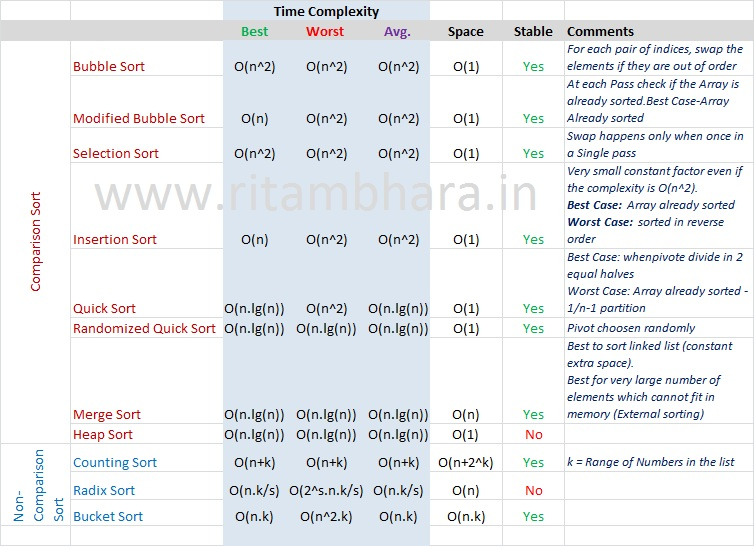

### Bubble Sort

It is a comparison-based algorithm in which each pair of adjacent elements is compared and the elements are swapped if they are not in order.


### Merge Sort

Merge sort first divides the array into equal halves and then combines them in a sorted manner.

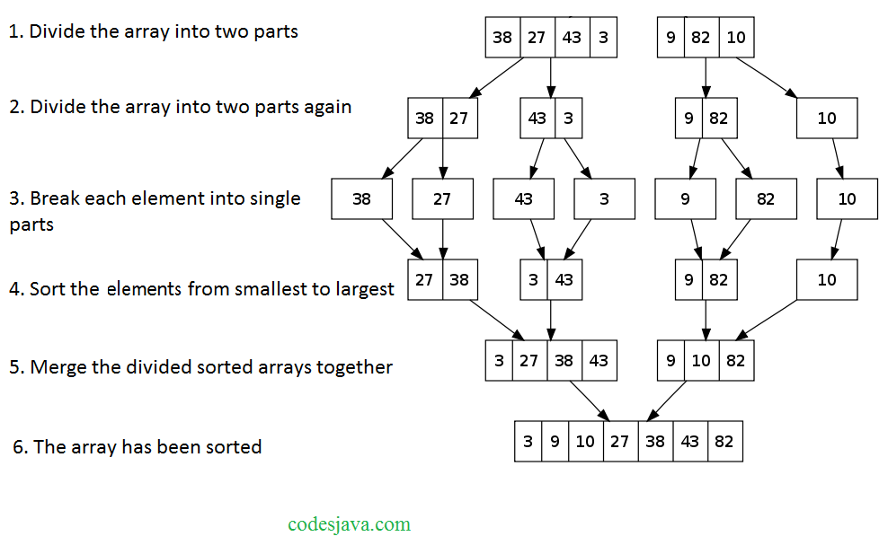

### Insertion Sort

Insertion sort involves finding the right place for a given element in a sorted list. So in beginning we compare the first two elements and sort them by comparing them. Then we pick the third element and find its proper position among the previous two sorted elements. This way we gradually go on adding more elements to the already sorted list by putting them in their proper position.


### Shell Sort

Shell Sort involves sorting elements which are away from ech other. We sort a large sublist of a given list and go on reducing the size of the list until all elements are sorted. The below program finds the gap by equating it to half of the length of the list size and then starts sorting all elements in it. Then we keep resetting the gap until the entire list is sorted.

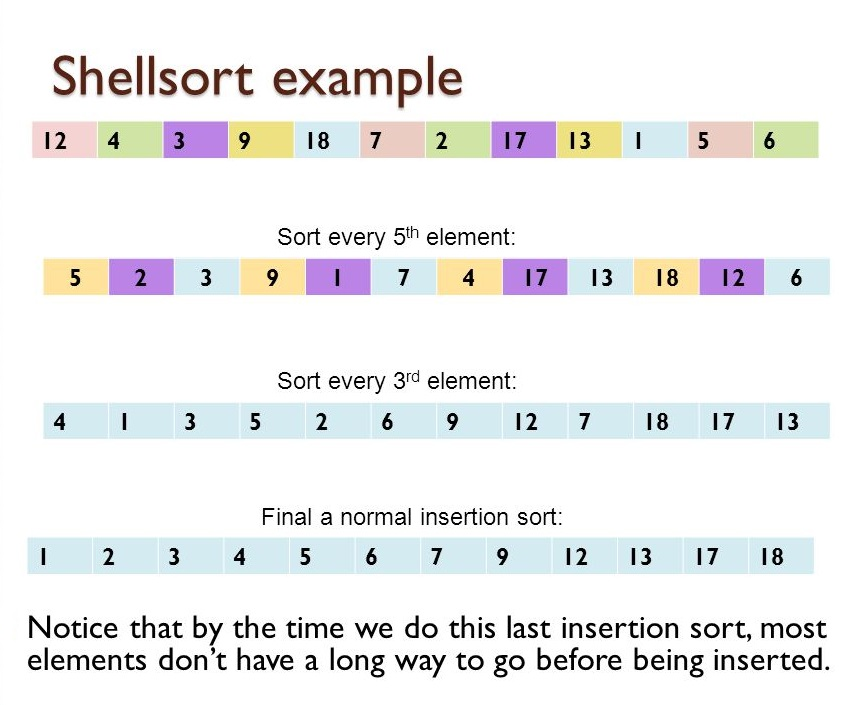

### Select Sort

In selection sort we start by finding the minimum value in a given list and move it to a sorted list. Then we repeat the process for each of the remaining elements in the unsorted list. The next element entering the sorted list is compared with the existing elements and placed at its correct position. So at the end all the elements from the unsorted list are sorted.


## [Graphs](graphs_traversals.py)

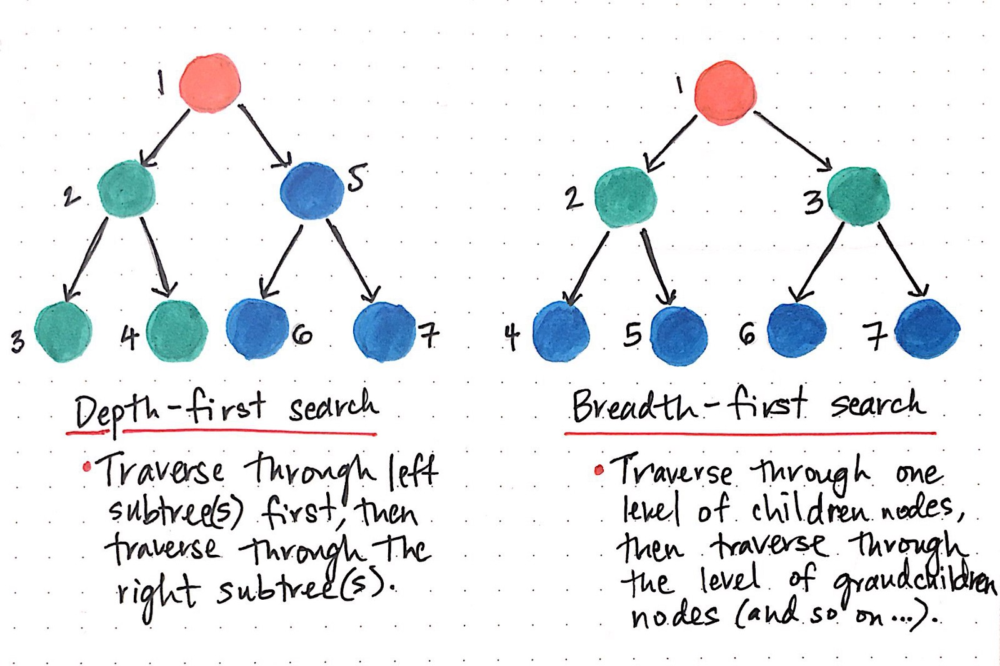

### Depth First Traversal

Also called depth first search (DFS),this algorithm traverses a graph in a depth ward motion and uses a stack to remember to get the next vertex to start a search, when a dead end occurs in any iteration. We implement DFS for a graph in python using the set data types as they provide the required functionalities to keep track of visited and unvisited nodes.

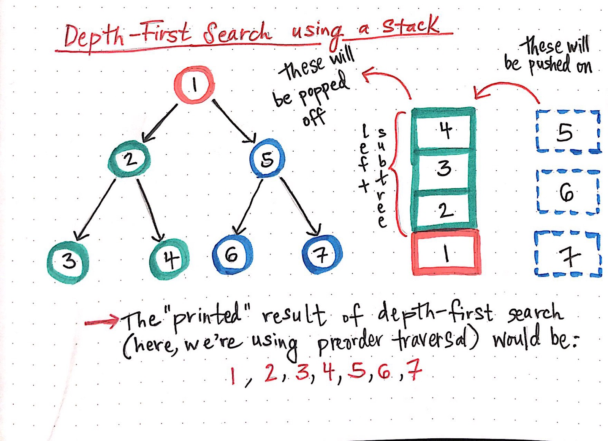

### Breadth First Traversal

Also called breadth first search (BFS),this algorithm traverses a graph breadth ward motion and uses a queue to remember to get the next vertex to start a search, when a dead end occurs in any iteration. Please visit this link in our website to understand the details of BFS steps for a graph.

We implement BFS for a graph in python using queue data structure discussed earlier. When we keep visiting the adjacent unvisited nodes and keep adding it to the queue. Then we start dequeue only the node which is left with no unvisited nodes. We stop the program when there is no next adjacent node to be visited.

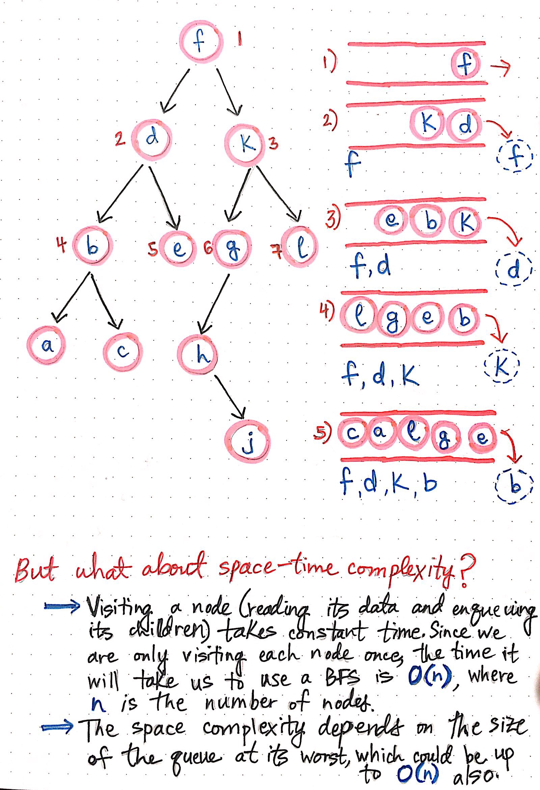

## Recursion
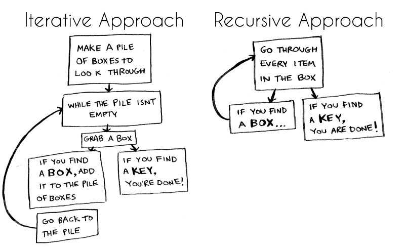

## Greedy
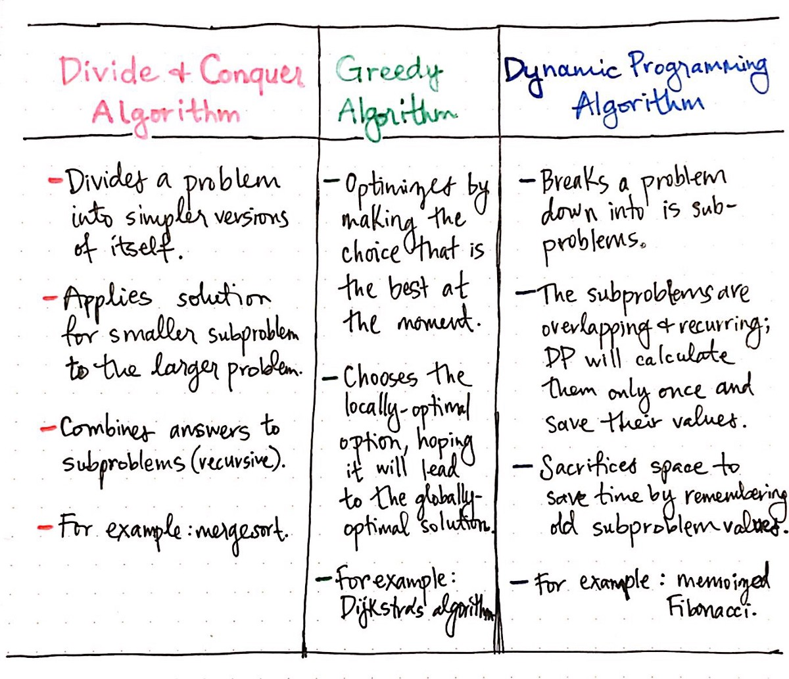

### Activity Selection Problem

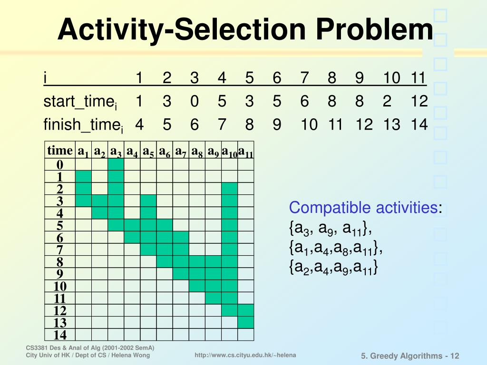

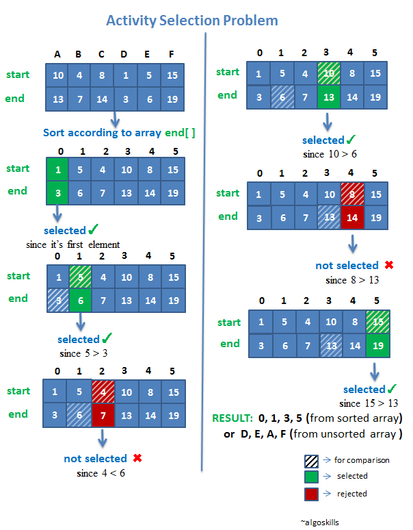

### Kruskal Minimum Spanning Tree

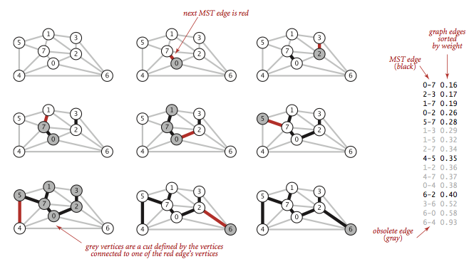


### Huffman Coding

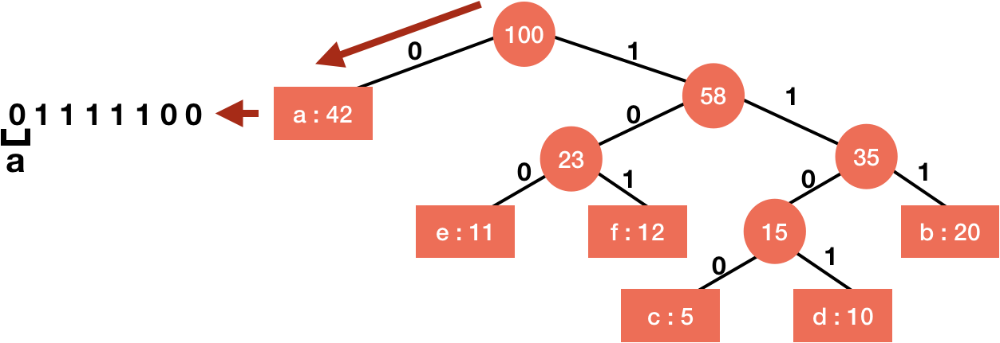


### Job Sequencing

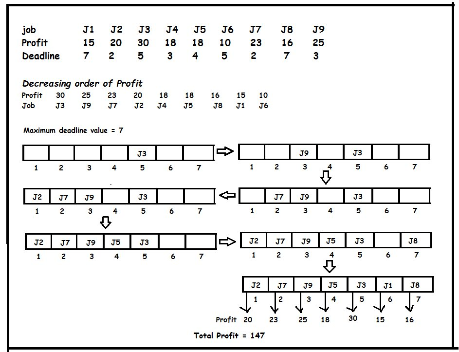


### Dijksta Minimum Path

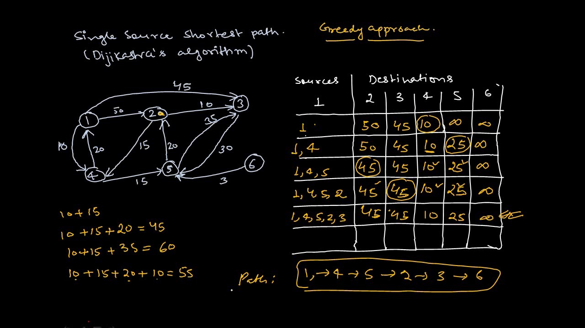


### Prim Minimum Spanning Tree

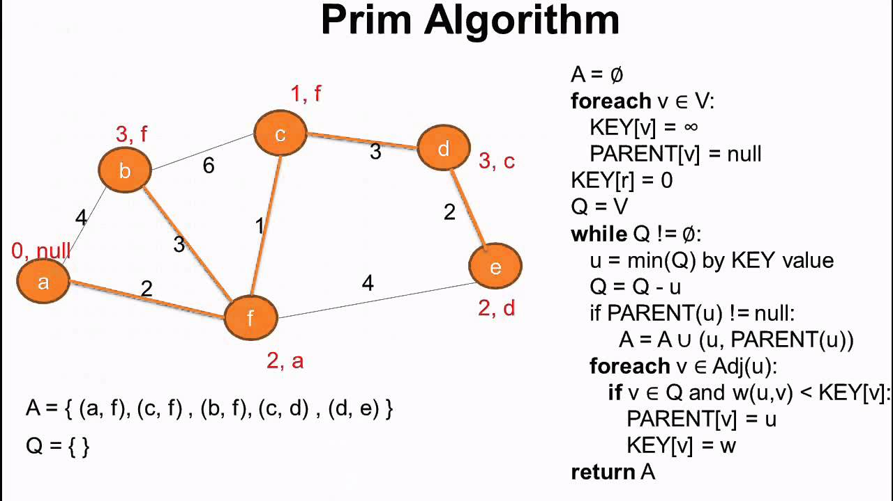


## Dynamic Programming
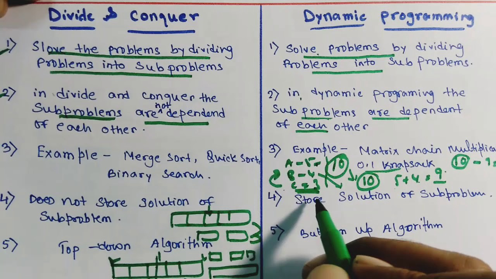

### Knapsack problem

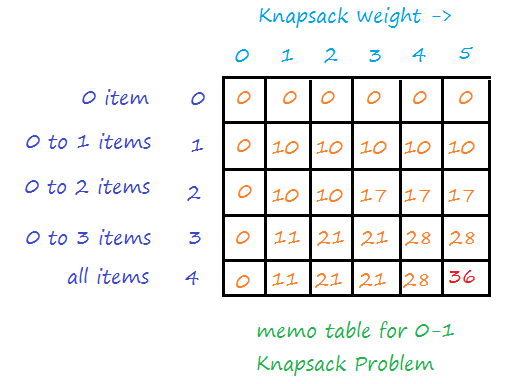

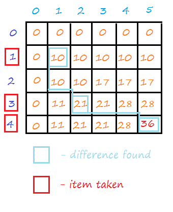

## Backtracking

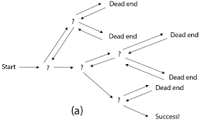
