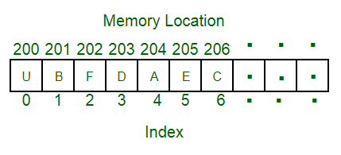
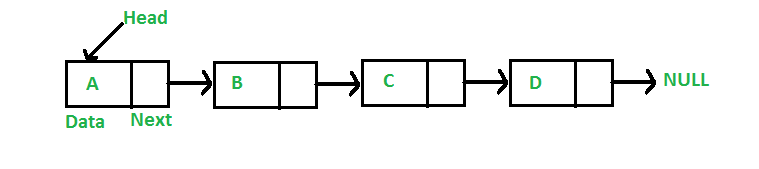
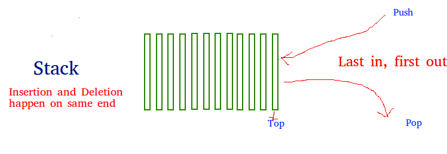
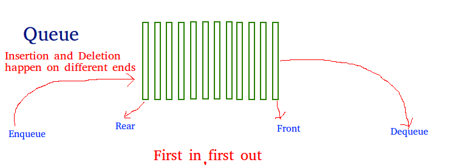
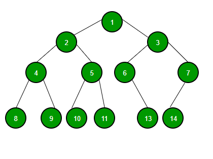
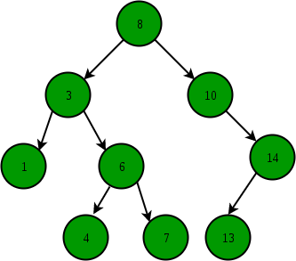
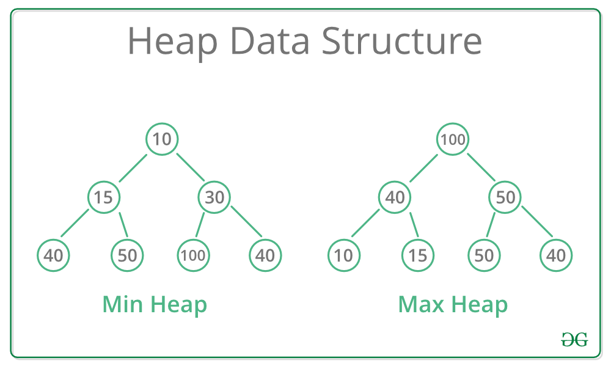
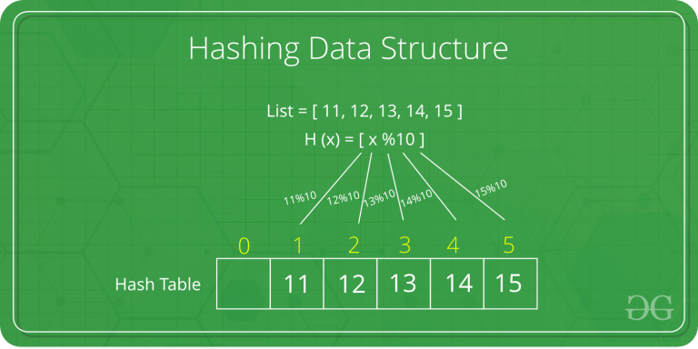
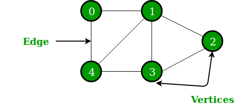
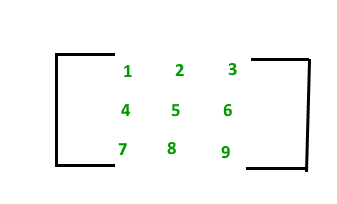

# Data Structures

Data organization, management, and storage format that enables efficient access and modification. More precisely, a data structure is a collection of data values, the relationships among them, and the functions or operations that can be applied to the data.

Data structures serve as the basis for abstract data types (ADT). The ADT defines the logical form of the data type. The data structure implements the physical form of the data type.

**What are linear and non linear data Structures?**

*Linear*: A data structure is said to be linear if its elements form a sequence or a linear list. Examples: Array. Linked List, Stacks and Queues

*Non-Linear*: A data structure is said to be non-linear if traversal of nodes is nonlinear in nature. Example: Graph and Trees.

### Basic Operations

The data in the data structures are processed by certain operations. The particular data structure chosen largely depends on the frequency of the operation that needs to be performed on the data structure.

* Traversing
* Searching
* Insertion
* Deletion
* Sorting
* Merging

## Array Data Structure



Array is a container which can hold a fix number of items and these items should be of the same type. 

An **array** is a number of elements in a specific order, typically all of the same type. *Elements* are accessed using an integer index to specify which element is required. Typical implementations allocate contiguous memory words for the elements of arrays. Arrays may be fixed-length or resizable.

Collection of items stored at contiguous memory locations. The idea is to store multiple items of the same type together. This makes it easier to calculate the position of each element by simply adding an offset to a base value, i.e., the memory location of the first element of the array (generally denoted by the name of the array).

*Advantages of using arrays:*

* Arrays allow random access of elements. This makes accessing elements by position faster.
* Arrays have better cache locality that can make a pretty big difference in performance.

### Arrays basic operations

**Traverse** − print all the array elements one by one.

**Insertion** − Adds an element at the given index.

**Deletion** − Deletes an element at the given index.

**Search** − Searches an element using the given index or by the value.

**Update** − Updates an element at the given index.

indexing: O(1)
searching: O(n)
insertion: O(n)
push: O(n) Note: O(1) Amortized
deletion: O(n)


### Arrays in Python

*Python has a set of built-in methods that you can use on lists/arrays.*

Create:
```
cars = ["Ford", "Volvo", "BMW"]
```

Access element:
```
x = cars[0]
```

Loop:
```
for x in cars:
  print(x)
```

| Method    | Description  |
|:-:        |  ---         |
| append()  | Adds an element at the end of the list  |
| clear()   | Removes all the elements from the list  |
| copy()    | Returns a copy of the list  |
| count()   | Returns the number of elements with the specified value  |
| extend()  | Add the elements of a list (or any iterable), to the end of the current list |
| index()   |	Returns the index of the first element with the specified value |
| insert()  |	Adds an element at the specified position |
| pop()	    | Removes the element at the specified position |
| remove()	| Removes the first item with the specified value |
| reverse()	| Reverses the order of the list | 
| sort()	| Sorts the list |

## Linked list



- A **linked list** (also just called *list*) is a linear collection of data elements of any type, called nodes, where each node has itself a value, and points to the next node in the linked list. The principal advantage of a linked list over an array, is that values can always be efficiently inserted and removed without relocating the rest of the list. Certain other operations, such as random access to a certain element, are however slower on lists than on arrays.

**Types of Linked List:**

**Singly Linked List**: In this type of linked list, every node stores address or reference of next node in list and the last node has next address or reference as NULL. 

For example 1->2->3->4->NULL

**Doubly Linked List**: Here, here are two references associated with each node, One of the reference points to the next node and one to the previous node. 
Eg. NULL<-1<->2<->3->NULL

**Circular Linked List**: Circular linked list is a linked list where all nodes are connected to form a circle. There is no NULL at the end. A circular linked list can be a singly circular linked list or doubly circular linked list. 

Eg. 1->2->3->1 [The next pointer of last node is pointing to the first]


**How is an Array different from Linked List?**

- The size of the arrays is fixed, Linked Lists are Dynamic in size.
- Inserting and deleting a new element in an array of elements is expensive, Whereas both insertion and deletion can easily be done in Linked Lists.
- Random access is not allowed in Linked Listed.
- Extra memory space for a pointer is required with each element of the Linked list.
- Arrays have better cache locality that can make a pretty big difference in performance.

### Linked lists basic operations

**Insertion** − Adds an element at the beginning of the list.

**Deletion** − Deletes an element at the beginning of the list.

**Display** − Displays the complete list.

**Search** − Searches an element using the given key.

**Delete** − Deletes an element using the given key.

indexing: O(n)
searching: O(n)
insertion: O(1)
deletion: O(1)

## Stack



Stack is a linear data structure which follows a particular order in which the operations are performed. The order may be LIFO(Last In First Out) or FILO(First In Last Out).

### Basic operations of stack

**push**() − Pushing (storing) an element on the stack.

**pop**() − Removing (accessing) an element from the stack.

When data is PUSHed onto stack.

To use a stack efficiently, we need to check the status of stack as well. For the same purpose, the following functionality is added to stacks −

**peek**() − get the top data element of the stack, without removing it.

**isFull**() − check if stack is full.

**isEmpty**() − check if stack is empty.

Applications of Stack:

Infix to Postfix Conversion using Stack
Evaluation of Postfix Expression
Reverse a String using Stack
Implement two stacks in an array
Check for balanced parentheses in an expression

## Queue



A Queue is a linear structure which follows a particular order in which the operations are performed. The order is First In First Out (FIFO). A good example of a queue is any queue of consumers for a resource where the consumer that came first is served first. The difference between stacks and queues is in removing. In a stack we remove the item the most recently added; in a queue, we remove the item the least recently added.

 Mainly the following are basic operations on queue: **Enqueue, Dequeue, Front, Rear**

The difference between stacks and queues is in removing. In a stack we remove the item the most recently added; in a queue, we remove the item the least recently added. Both Queues and Stacks can be implemented using Arrays and Linked Lists.

## Binary Tree



A tree whose elements have at most 2 children is called a binary tree. Since each element in a binary tree can have only 2 children, we typically name them the left and right child.

A Binary Tree node contains following parts.

- Data
- Pointer to left child
- Pointer to right child

### Binary search tree (BST)



Binary Search Tree is a node-based binary tree data structure which has the following properties:

* The left subtree of a node contains only nodes with keys lesser than the node’s key.
* The right subtree of a node contains only nodes with keys greater than the node’s key.
* The left and right subtree each must also be a binary search tree.

searching: O(log n)
insertion: O(log n)
deletion: O(log n)

### Heap



A Heap is a special Tree-based data structure in which the tree is a complete binary tree. Generally, Heaps can be of two types:

1. Max-Heap: In a Max-Heap the key present at the root node must be greatest among the keys present at all of it’s children. The same property must be recursively true for all sub-trees in that Binary Tree.
2. Min-Heap: In a Min-Heap the key present at the root node must be minimum among the keys present at all of it’s children. The same property must be recursively true for all sub-trees in that Binary Tree.

min/max: O(1)
insertion: O(log n)
deletion: O(log n)

## Hash Tables



Hashing is an important Data Structure which is designed to use a special function called the Hash function which is used to map a given value with a particular key for faster access of elements. The efficiency of mapping depends of the efficiency of the hash function used.

Let a hash function H(x) maps the value x at the index x%10 in an Array. For example if the list of values is [11,12,13,14,15] it will be stored at positions {1,2,3,4,5} in the array or Hash table respectively.

value lookup: O(1)
insertion: O(1)
deletion: O(1)

## Graphs



A Graph is a non-linear data structure consisting of nodes and edges. The nodes are sometimes also referred to as vertices and the edges are lines or arcs that connect any two nodes in the graph. More formally a Graph can be defined as,

A Graph consists of a finite set of vertices(or nodes) and set of Edges which connect a pair of nodes.

## Matrix



A matrix represents a collection of numbers arranged in an order of rows and columns. It is necessary to enclose the elements of a matrix in parentheses or brackets.

## PYTHON SPECIFIC DATA STRUCTURES

These data structures are specific to python language and they give greater flexibility in storing different types of data and faster processing in python environment.

**List**: It is similar to array with the exception that the data elements can be of different data types. You can have both numeric and string data in a python list.

**Tuple**: Tuples are similar to lists but they are immutable which means the values in a tuple cannot be modified they can only be read.
A tuple is a sequence of immutable Python objects. Tuples are sequences, just like lists. The differences between tuples and lists are, the tuples cannot be changed unlike lists and tuples use parentheses, whereas lists use square brackets.

**Dictionary**: The dictionary contains Key-value pairs as its data elements.
In Dictionary each key is separated from its value by a colon (:), the items are separated by commas, and the whole thing is enclosed in curly braces. An empty dictionary without any items is written with just two curly braces, like this: {}.

Keys are unique within a dictionary while values may not be. The values of a dictionary can be of any type, but the keys must be of an immutable data type such as strings, numbers, or tuples.

- More than one entry per key not allowed. Which means no duplicate key is allowed. When duplicate keys encountered during assignment, the last assignment wins.

- Keys must be immutable. Which means you can use strings, numbers or tuples as dictionary keys but something like ['key'] is not allowed.
